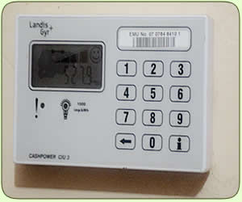
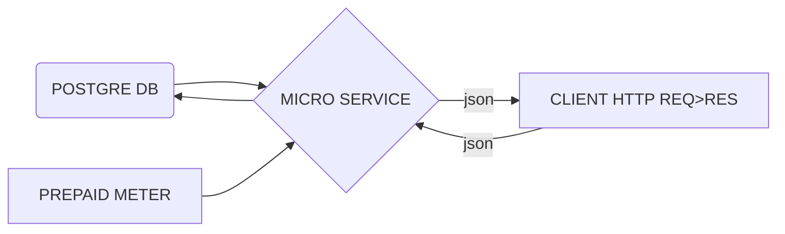

# Prepaid Electricity Meter Microservice



This microservice is designed to facilitate the management of prepaid electricity meters, allowing for seamless interaction with the meters to send and receive data. Developed by Black, this microservice supports functionalities related to meters, logs, and configurations.

## Features

- **Meter Management**: Access and manage information related to prepaid electricity meters.
- **Logging**: Record and retrieve logs for tracking meter-related activities.
- **Configurations**: Configure settings for the microservice.

## Getting Started

To run the microservice locally, follow these steps:

1. Install the required dependencies by running:

   ```bash
   pip install -r requirements.txt   
2. Make sure you have PostgreSQL installed and configured, as this microservice uses it as the database.
Ensure that the database tables are created by running:
    ```bash 
	python main.py
3. Start the microservice using Uvicorn:
    ```bash 
	python main.py	uvicorn main:app --reload
   The microservice will be accessible at http://127.0.0.1:8000.

## API Endpoints
- Meter API: Access and manage prepaid electricity meter information.
   -  Endpoint: /api/meter 
   
 - Logs API: Record and retrieve logs related to meter activities.
   - Endpoint: /api/logger

- Configs API: Configure settings for the microservice.
   - Endpoint: /api/configs
## Exception Handling
The microservice includes a global exception handler to capture and respond to exceptions gracefully. Any exception during the execution will result in a JSON response with details about the failure.

## Root Endpoint
Visit the root endpoint at http://127.0.0.1:8000/ to receive a welcome message and copyright information.

## Dependencies
FastAPI
SQLAlchemy
Uvicorn
Gunicorn
Pydantic
Psycopg2-binary

## FLow Diagram


Flowchart of the microservice



## Note
This microservice is specifically designed for prepaid electricity meter functionality, focusing on efficient data exchange between the microservice and the meters. Make sure to check and update the configurations accordingly, especially the PostgreSQL database connection details.

Feel free to explore and customize the microservice based on your specific requirements.


**Developed by Black, Copyright @ 2023.**
